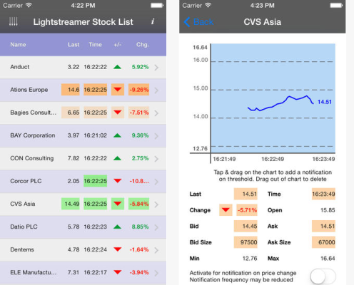

# Lightstreamer - Stock-List Demo - iOS Client

<!-- START DESCRIPTION lightstreamer-example-stocklist-client-ios -->

This project contains an example of an application for iPhone and iPad that employs the [Lightstreamer iOS Client library](http://www.lightstreamer.com/docs/client_ios_api/index.html), with use of mobile push notifications (MPN).

## Live Demo

 
###[ View live demo](http://itunes.apple.com/us/app/lightstreamer-stocklist/id430328811#) 

## Details

This app, compatible with both iPhone and iPad, is an Objective-C version of the [Stock-List Demos](https://github.com/Weswit/Lightstreamer-example-Stocklist-client-javascript). 

This app uses the <b>iOS Client API for Lightstreamer</b> to handle the communications with Lightstreamer Server. A simple user interface is implemented to display the real-time data received from Lightstreamer Server. Additionally, the user interface provides means to activate and deactivate mobile push notifications for specific stock quotes. 

## Install

Binaries for the application are not provided, but it may be downloaded from the App Store at [this address](https://itunes.apple.com/app/lightstreamer-stocklist/id430328811?l=en&mt=8). The downloaded app will connect to Lightstreamer's online demo server.

## Build

A full Xcode project specification, ready for compilation of the app sources, is provided. Please recall that you need a valid iOS Developer Program membership to run or debug your app on a test device.

### Getting Started

Before you can build this demo, you should complete this project with the Lighstreamer iOS Client library. Follow these steps:

* Drop into the `Lightstreamer client for iOS/lib` folder of this project the *Lightstreamer_iOS_client.a* file from the `/DOCS-SDKs/sdk_client_ios/lib` of [Lightstreamer distribution version 6.0 or greater](http://www.lightstreamer.com/download).
* Drop into the `Lightstreamer client for iOS/include` folder of this project all the include files from the `/DOCS-SDKs/sdk_client_ios/include` of [Lightstreamer distribution version 6.0 or greater](http://www.lightstreamer.com/download).

Done this, the project should compile with no errors.

### Compile and Run

A full local deploy of this app requires a Lightstreamer Server 6.0 installation with appropriate Mobile Push Notifications (MPN) module configuration. A detailed step by step guide for setting up the server and configuring the client is available in the README of the following project:

* [Lightstreamer - MPN Stock-List Demo Metadata - Java Adapter](https://github.com/Weswit/Lightstreamer-example-StockListMetadata-adapter-java)

If mobile push notifications are not required, please refer to a simplified version of this demo available here:

* [Lightstreamer - Stock-List Demo - iOS Client](https://github.com/Weswit/Lightstreamer-example-StockList-client-ios)

## See Also

### Lightstreamer Adapters Needed by This Demo Client

* [Lightstreamer - Stock- List Demo - Java Adapter](https://github.com/Weswit/Lightstreamer-example-Stocklist-adapter-java)
* [Lightstreamer - MPN Stock-List Demo Metadata - Java Adapter](https://github.com/Weswit/Lightstreamer-example-StockListMetadata-adapter-java)

### Related Projects

* [Lightstreamer - Stock-List Demos - HTML Clients](https://github.com/Weswit/Lightstreamer-example-Stocklist-client-javascript)
* [Lightstreamer - Stock-List Demo - iOS Client](https://github.com/Weswit/Lightstreamer-example-StockList-client-ios)
* [Lightstreamer - Basic Stock-List Demo - OS X Client](https://github.com/Weswit/Lightstreamer-example-StockList-client-osx)
* [Lightstreamer - Basic Stock-List Demo - Android Client](https://github.com/Weswit/Lightstreamer-example-StockList-client-android)
* [Lightstreamer - Basic Stock-List Demo - Windows Phone Client](https://github.com/Weswit/Lightstreamer-example-StockList-client-winphone)
* [Lightstreamer - Basic Stock-List and Round-Trip Demo - BlackBerry Client](https://github.com/Weswit/Lightstreamer-example-StockList-client-blackberry)
* [Lightstreamer - Basic Stock-List Demo jQuery (jqGrid) Client](https://github.com/Weswit/Lightstreamer-example-StockList-client-jquery)
* [Lightstreamer - Stock-List Demo - Dojo Toolkit Client](https://github.com/Weswit/Lightstreamer-example-StockList-client-dojo)
* [Lightstreamer - Basic Stock-List Demo - Java SE (Swing) Client](https://github.com/Weswit/Lightstreamer-example-StockList-client-java)
* [Lightstreamer - Basic Stock-List Demo - .NET Client](https://github.com/Weswit/Lightstreamer-example-StockList-client-dotnet)
* [Lightstreamer - Stock-List Demos - Flex Clients](https://github.com/Weswit/Lightstreamer-example-StockList-client-flex)

## Lightstreamer Compatibility Notes

* Compatible with Lightstreamer iOS Client Library version 1.4 or newer.
* For Lightstreamer Allegro (+ iOS Client API support), Presto, Vivace, version 6.0 or greater.
