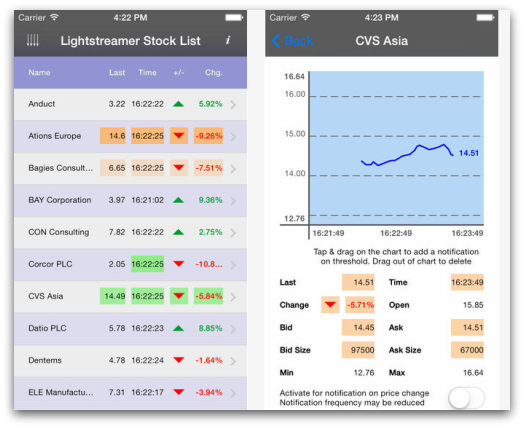

# Lightstreamer - Basic Stock-List Demo - iOS Client

<!-- START DESCRIPTION lightstreamer-example-stocklist-client-ios -->

This project contains an example of an application for iPhone and iPad that employs the [Lightstreamer iOS Client library](http://www.lightstreamer.com/docs/client_ios_api/index.html).

## Live Demo

 
###[ View live demo](http://itunes.apple.com/us/app/lightstreamer-stocklist/id430328811#) 

## Details

This app, compatible with both iPhone and iPad, is an Objective-C version of the [Stock-List Demos](https://github.com/Weswit/Lightstreamer-example-Stocklist-client-javascript). 

This app uses the <b>iOS Client API for Lightstreamer</b> to handle the communications with Lightstreamer Server. A simple user interface is implemented to display the real-time data received from Lightstreamer Server. 
To install the app from the iTunes Store, you can either go to the [iTunes Preview page](http://itunes.apple.com/us/app/lightstreamer-stocklist/id430328811#) and choose "View In iTunes", or open iTunes and search for "Lightstreamer". 

## Build

Binaries for the application are not provided, but it may be downloaded from the App Store at [this address](https://itunes.apple.com/app/lightstreamer-stocklist/id430328811?l=en&mt=8).
Otherwise, a full Xcode project specification, ready for a compilation of the demo sources, is provided. Please recall that you need a valid iOS Developer Program membership to debug or deploy your app on a test device.
Before you can build this demo, you should complete this project with the Lighstreamer iOS Client library. Please:
* drop into the `Lightstreamer client for iOS/lib` folder of this project the Lightstreamer_iOS_client.a file from the `/DOCS-SDKs/sdk_client_ios/lib` of [latest Lightstreamer distribution](http://www.lightstreamer.com/download).
* drop into the `Lightstreamer client for iOS/include` folder of this project all the include files from the `/DOCS-SDKs/sdk_client_ios/include` of [latest Lightstreamer distribution](http://www.lightstreamer.com/download).

### Deploy

With the current settings, the demo tries to connect to the demo server currently running on Lightstreamer website.
The demo can be reconfigured and recompiled to connect to the local installation of Lightstreamer Server. You just have to change SERVER_URL, as defined in `Shared/StockListViewController.m`; a ":port" part can also be added.
The example requires that the [QUOTE_ADAPTER](https://github.com/Weswit/Lightstreamer-example-Stocklist-adapter-java) and [LiteralBasedProvider](https://github.com/Weswit/Lightstreamer-example-ReusableMetadata-adapter-java) have to be deployed in your local Lightstreamer server instance. The factory configuration of Lightstreamer server already provides this adapter deployed. 

### Mobile Push Notification

On the other hand, if you have reconfigured and recompiled the demo in order to connect to the local installation of Lightstreamer Server, the Mobile Push Notification features will not be available with the factory Server configuration.
In order to enable them, a few more steps are necessary: 
1. a new app ID must be provided through the [Apple Developers Portal](https://developer.apple.com/) and configured in the Xcode project in its General page (under Bundle Identifier);
2. certificate for mobile push notifications, related to the new app ID, must be generated through the Apple Developers Portal and provided to Xcode (double-clicking is usually sufficient);
3. an <app> block specifying the new app ID must be added to the Server's `conf/mpn/apns/apns_notifier_conf.xml` configuration file (a commented example is provided) and the <service_level> element must be set properly;
4. the generated certificate must be exported in p12 format through the Apple Developers Portal and provided to the Server through the proper configuration elements in the <app> block;
5. in the <app> block, the trigger expression filter must also be enabled, in order for the notifications on threshold to work correctly; the included sample regular expression matches what is required by the demo app;
6. a back-end database must be provided to the Server through its specific `conf/mpn/hibernate.cfg.xml` configuration file;
7. the Server's MPN (mobile push notification) module must be enabled in its `conf/lightstreamer_conf.xml` configuration file (see the <mpn> block).

Steps 1-2 are common business for the development of any application that must receive mobile push notifications, more information may be found on the Apple Developers Portal, e.g.: [https://developer.apple.com/notifications/](https://developer.apple.com/notifications/). 
Step 3-5 are required by the Server to send mobile push notifications to the correct application, with the correct certificate and applying a reasonable security filtering on incoming requests. More information may be found in the configuration file itself. 
Step 6 is required by the Server to store mobile push notifications subscriptions and retrieve them after a Server restart. 
Finally, step 7 is need by the Server to active its <b>MPN module<b>, which is disabled by default. 

## See Also

### Lightstreamer Adapters Needed by This Demo Client

* [Lightstreamer - Stock- List Demo - Java Adapter](https://github.com/Weswit/Lightstreamer-example-Stocklist-adapter-java)
* [Lightstreamer - Reusable Metadata Adapters- Java Adapter](https://github.com/Weswit/Lightstreamer-example-ReusableMetadata-adapter-java)

### Related Projects

* [Lightstreamer - Stock-List Demos - HTML Clients](https://github.com/Weswit/Lightstreamer-example-Stocklist-client-javascript)
* [Lightstreamer - Basic Stock-List Demo - OS X Client](https://github.com/Weswit/Lightstreamer-example-StockList-client-osx)
* [Lightstreamer - Basic Stock-List Demo - Android Client](https://github.com/Weswit/Lightstreamer-example-StockList-client-android)
* [Lightstreamer - Basic Stock-List Demo - Windows Phone Client](https://github.com/Weswit/Lightstreamer-example-StockList-client-winphone)
* [Lightstreamer - Basic Stock-List and Round-Trip Demo - BlackBerry Client](https://github.com/Weswit/Lightstreamer-example-StockList-client-blackberry)
* [Lightstreamer - Basic Stock-List Demo jQuery (jqGrid) Client](https://github.com/Weswit/Lightstreamer-example-StockList-client-jquery)
* [Lightstreamer - Stock-List Demo - Dojo Toolkit Client](https://github.com/Weswit/Lightstreamer-example-StockList-client-dojo)
* [Lightstreamer - Basic Stock-List Demo - Java SE (Swing) Client](https://github.com/Weswit/Lightstreamer-example-StockList-client-java)
* [Lightstreamer - Basic Stock-List Demo - .NET Client](https://github.com/Weswit/Lightstreamer-example-StockList-client-dotnet)
* [Lightstreamer - Stock-List Demos - Flex Clients](https://github.com/Weswit/Lightstreamer-example-StockList-client-flex)

## Lightstreamer Compatibility Notes

* Compatible with Lightstreamer iOS Client Library version 1.3 or newer.
* For Lightstreamer Allegro (+ iOS Client API support), Presto, Vivace.
